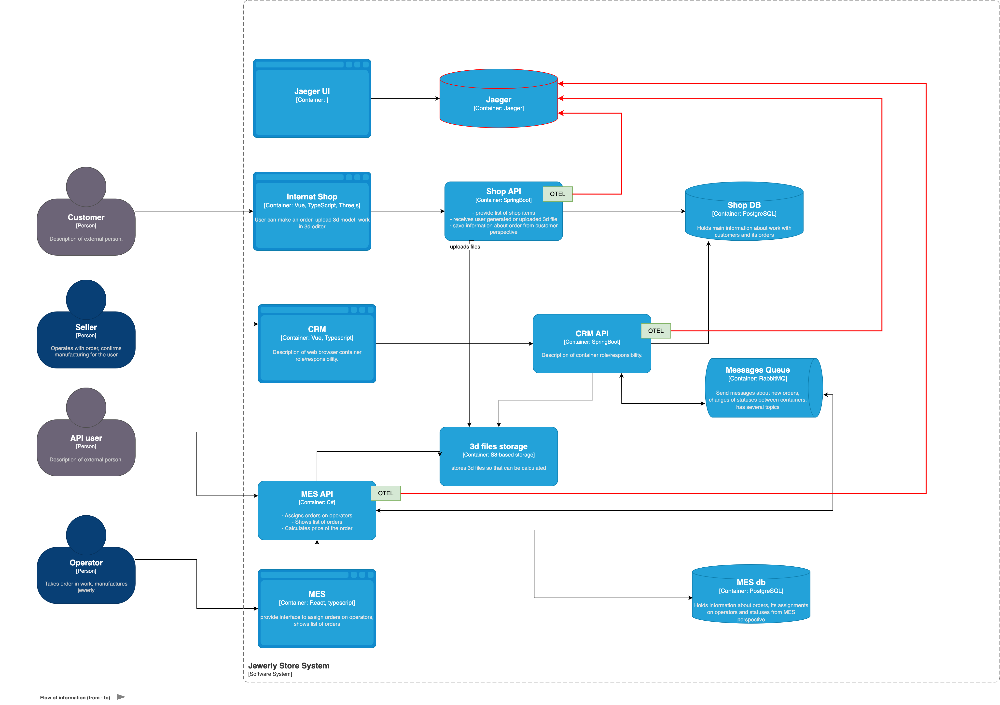

## I. Области для трассировки

1. Путь заказа между CRM и MES через RabbitMQ — передаваемые поля: trace_id, user_id, order_id, timestamp, topic.
2. Взаимодействие внешних продавцов с MES API — trace_id, client_id, метод, endpoint, код ответа.

## II. Мотивация

В настоящий момент жалобы клиентов часто связаны с исчезновением или задержками заказов между системами — нельзя однозначно определить место сбоя. Трассировка даёт сквозную видимость цепочки и позволяет:
- быстро локализовать место задержки или потери сообщения;
- снизить время расследования инцидентов;
- улучшить соблюдение KPI операторов;
- уменьшить число потерянных и просроченных заказов.

## III. Предлагаемое решение

- Стек: OpenTelemetry SDK для инструментирования + Jaeger для хранения и визуализации трасс.
- Новые компоненты: развернуть Jaeger.
- Изменения в сервисах: подключить OpenTelemetry в CRM API, MES API и Shop API; обеспечить отправку трасс в Jaeger и проброс trace_id через заголовки HTTP.

Схема:

## IV Компромиссы

Трассировка добавляет нагрузку на сеть и CPU и требует дискового пространства для хранения следов. Полный сбор трасс для всех запросов быстро увеличит затраты на хранение и обработку. Чтобы снизить влияние, будем использовать sampling, ограничим объём bag­gage и включим детальную трассировку выборочно — по типовому заказу, по ошибочному трафику или по запросу инженеров.

## V Безопасность

Доступ к системе трейсинга должен быть строго контролируемым:

- централизованная аутентификация и RBAC — только авторизованные роли (Support, DevOps, Dev) видят данные;
- доступ к UI и хранилищу трасс — из доверенной сети или через zero‑trust шлюз;
- шифрование каналов и данных в покое;
- аудит доступа и логирование действий в интерфейсе трейсинга.

### VI Метрики, на которые повлияет внедрение трейсинга

1) **MTTR (mean time to recovery)**  
   Трейсы сокращают время диагностики и исправления инцидентов.

2) **Error rate (доля ошибок) в цепочке обработки заказа**  
   Видно, где именно возникают ошибки (API, очередь, S3, БД).

3) **Latency p95/p99 по критичным операциям**  
   Например, “получение дашборда MES”, “расчёт цены”, “публикация/консюм события”.

4) **Доля заказов, “застрявших” в статусе дольше порога**
   Трейсинг помогает быстро классифицировать причины и убрать узкие места.

5) **Снижение количества обращений/жалоб по статусу заказа**  
   Потому что поддержка и продавцы видят, где заказ находится, и могут дать корректный ответ.
