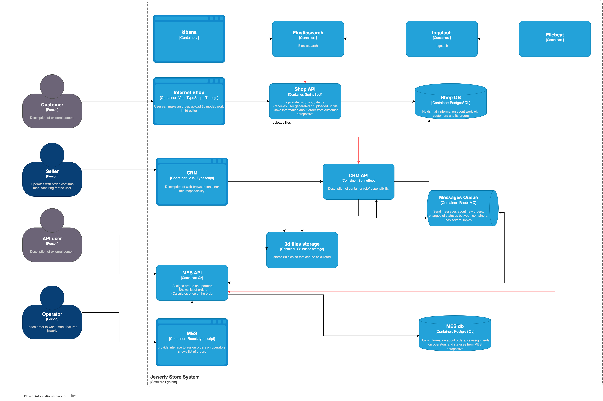

## I. Перечень собираемых логов

Необходимо определить состав логов, подлежащих сбору, а также зафиксировать на архитектурной схеме системы-источники логирования. Для всех ключевых бизнес-событий формируется перечень логов с уровнем **INFO**.

**Пример:**  
при изменении статуса заказа фиксируются дата и время события, идентификатор покупателя и номер заказа.

Дополнительно требуется указать используемые уровни логирования и условия их применения.

### Аутентификация пользователей
- дата и время события аутентификации

### Системы, подлежащие логированию

#### 1. Онлайн-магазин
Логируются пользовательские действия:
- вход в систему: время события, идентификатор покупателя, данные клиентского окружения (браузер, устройство и т.п.);
- создание заказа: время, идентификатор покупателя, номер заказа;
- загрузка 3D-модели: время, имя файла, размер файла, идентификатор загруженной модели.

#### 2. CRM
- создание заказов и изменение их статусов: время события, идентификатор покупателя, номер заказа;
- ключевые действия менеджеров (подтверждение заказа, ручное закрытие): дата и время, тип операции, идентификатор менеджера.

#### 3. MES (React + C#)
- расчет стоимости заказа: время операции, идентификатор покупателя, номер заказа, рассчитанная стоимость;
- входящие API-запросы: время, URL, HTTP-метод, заголовки, тело запроса;
- действия операторов (взятие заказа в работу, завершение производства): дата и время, тип операции, идентификатор оператора.

### Используемые уровни логирования
- **ERROR / FATAL** — все критические ошибки (ошибки расчёта стоимости, создания заказа, взаимодействия с API и т.д.);
- **WARN** — некритичные, но потенциально проблемные ситуации, требующие внимания;
- **DEBUG** — используется на тестовых стендах и временно включается для отладки и внедрения новых функциональных возможностей.

---

## II. Мотивация внедрения логирования

Логирование позволяет:
- ускорить поиск причин ошибок и разбор инцидентов;
- выявлять узкие и проблемные места в системе;
- упрощать отладку и ввод новых функциональных возможностей;
- использовать данные логов для построения метрик и аналитики.

### Метрики, на которые влияет внедрение логирования
- сокращение time-to-market за счёт ускорения тестирования и исправления дефектов;
- снижение среднего времени реагирования и разбора инцидентов;
- улучшение KPI по выполнению заказов;
- снижение общего уровня ошибок (error rate);
- повышение показателей SLA.

### Приоритетные системы для логирования и трейсинга
- **MES** — из-за проблем с расчётом стоимости, некорректной работы дашборда операторов и большого количества обращений к API;
- **RabbitMQ** — в связи с потерей заказов при сбоях в работе очередей.

## III. Предлагаемое решение

### Технологический стек логирования
В качестве решения для централизованного сбора, хранения и анализа логов предлагается использовать **ELK-стек**:
- **Elasticsearch** — хранение и индексирование логов;
- **Logstash** — сбор, парсинг и обогащение логов;
- **Kibana** — визуализация, поиск и анализ логов.

### Архитектурная схема

### Модель доступа к логам
- разработчики, аналитики, тестировщики и продуктовые менеджеры имеют доступ **только к логам своих сервисов**;
- команда поддержки имеет доступ **ко всем логам системы** для оперативного реагирования на инциденты.

### Политика хранения логов
- тестовый контур — хранение логов **1 месяц**;
- продакшн — хранение логов **3 месяца**, после чего данные архивируются сроком **до 1 года**.

---

## IV. Анализ логов и алертинг

### 1. Алертинг
Настраиваются автоматические уведомления при следующих условиях:
- если расчёт стоимости заказа занимает более **5 минут** — отправляется уведомление в Mattermost и/или по электронной почте;
- если количество ошибок превышает **25 в минуту** — отправляется уведомление в Mattermost и/или по электронной почте.

### 2. Выявление аномалий
На основе логов и метрик выявляются нетипичные паттерны поведения, в том числе:
- резкий рост количества заказов в нехарактерное время (например, в 03:00 ночи);
- повторяющиеся ошибки, возникающие регулярно в одно и то же время (например, ежедневно в 12:00).
