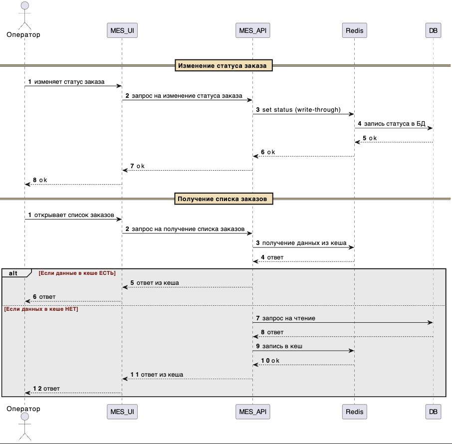

## I. Компоненты, подлежащие кешированию

Кеширование может применяться как на стороне клиента, так и на серверной стороне.

Основные точки, где целесообразно внедрить кеширование:
- дашборд MES (списки заказов, сгруппированные по статусам);
- результаты расчёта стоимости заказов в MES.

---

## II. Обоснование необходимости кеширования

Кеширование позволяет снизить нагрузку на базы данных и backend-сервисы, сократить время получения данных и повысить общую отзывчивость пользовательских интерфейсов.

В настоящий момент фиксируется повышенная нагрузка на MES:
- дашборд операторов работает с задержками из-за частых запросов списков заказов; кеширование позволит существенно ускорить формирование и отображение данных;
- расчёт стоимости заказа занимает от 2 до 30 минут; кеширование результатов вычислений позволит избежать повторных длительных операций при повторных запросах.

---

## III. Предлагаемое решение

Предлагаю комбинировать клиентское и серверное кеширование.

### Клиентское кеширование
Применяется для статических данных на клиентских приложениях:
- Shop UI;
- MES UI;
- CRM UI.

### Серверное кеширование
Реализуется на уровне backend-сервисов:
- MES API;
- CRM API.

Приоритетным является внедрение кеширования в MES API, так как именно данный компонент является основным источником проблем с производительностью.

---

## IV. Выбор паттерна кеширования

> «Операторам критично важно видеть самые актуальные заказы, поскольку от этого напрямую зависит их вознаграждение».

С учётом требования к актуальности данных предлагается использовать паттерн Write-Through.

При использовании Write-Through запись данных осуществляется одновременно в кеш и в базу данных, что гарантирует их согласованность.

Использование паттерна Cache-Aside может привести к рассинхронизации данных, так как изменения сначала попадают в базу данных, а кеш обновляется не сразу и может содержать устаревшие значения.

Паттерн Refresh-Ahead также может рассматриваться как вариант, однако он не исключает риск получения устаревших данных, поскольку обновление кеша происходит асинхронно.

### Схема

### Стратегия инвалидации кеша

Будем использовать инвалидацию кеша по событию изменения данных — кеш сбрасывается каждый раз при обновлении или изменении связанных сущностей. Такой подход соответствует требованию отображать для операторов исключительно актуальную информацию.

Использование временной инвалидации не является подходящим вариантом, так как сохраняется риск отображения устаревших данных, что недопустимо в контексте операционной работы операторов.
